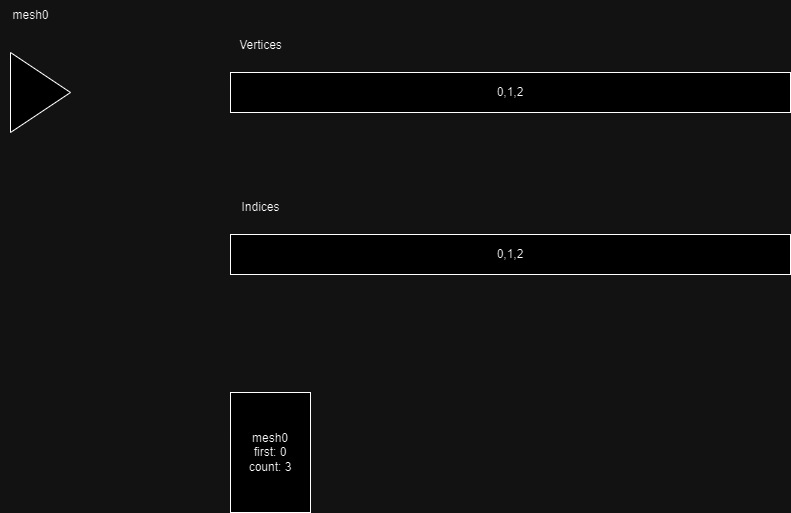
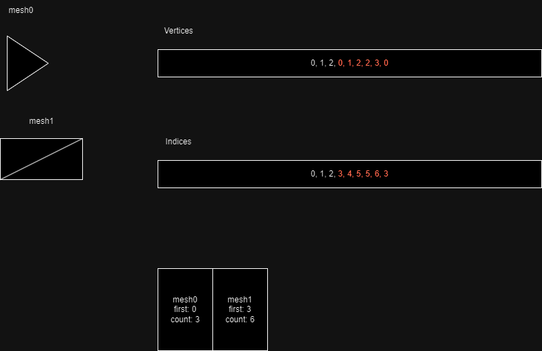

# Buffer Lumping
One technique we can try to speed things up is lumping all our buffers together. GPUs are like big heavy ships, they operate best when they have big heavy jobs and don't need to change course. Switching out vertex and index buffers for each new draw call can range from a bit of a nuissance to catastrophic.

## Theory
It's simple enough in theory, and a good puzzle. Our model factory maintains a single vertex and index container, then grows it as meshes are consumed one by one. It also remembers the first index and index count for each mesh.



The index of a vertex within a mesh is the local index within the mesh, plus the offset of that mesh into the vertex lump (ie, the number of vertices already on the vertex buffer right up to loading this new mesh).



Once all meshes have been loaded, the factory can be "finalized", at this point vertex and index buffers can be created and uploaded. The factory can then be queried to get the appropriate arguments for drawing.

## In Practice
We'll modify the interface for our MeshFactory. Note that material loading is now a public function, it will be separated from model loading.
```
class MeshFactory {

public:

    void consume(int i);
    Mesh finalize();
    unsigned int load_2d_material(const char* filename);
    std::unordered_map<uint32_t, uint32_t> firstIndices;
    std::unordered_map<uint32_t, uint32_t> indexCounts;

private:

    // ...

    std::vector<float> vertexLump;
    std::vector<uint32_t> indexLump;

};
```

Material loading doesn't need to change, except now we're using bindless textures the image size is no longer constrained to 1024 by 1024.

The finalize function is almost a copy-paste from the existing loader.
```
Mesh MeshFactory::finalize() {

    Mesh mesh;

    glGenVertexArrays(1, &mesh.VAO);
    glBindVertexArray(mesh.VAO);

    glGenBuffers(1, &mesh.VBO);
    glBindBuffer(GL_ARRAY_BUFFER, mesh.VBO);
    glBufferData(GL_ARRAY_BUFFER, vertexLump.size() * sizeof(float),
        vertexLump.data(), GL_STATIC_DRAW);
    //position
    glVertexAttribPointer(0, 3, GL_FLOAT, GL_FALSE, 32, (void*)0);
    glEnableVertexAttribArray(0);
    //texture coordinates
    glVertexAttribPointer(1, 2, GL_FLOAT, GL_FALSE, 32, (void*)12);
    glEnableVertexAttribArray(1);
    //normal
    glVertexAttribPointer(2, 3, GL_FLOAT, GL_FALSE, 32, (void*)20);
    glEnableVertexAttribArray(2);

    glGenBuffers(1, &mesh.EBO);
    glBindBuffer(GL_ELEMENT_ARRAY_BUFFER, mesh.EBO);
    glBufferData(GL_ELEMENT_ARRAY_BUFFER,
        indexLump.size() * sizeof(uint32_t),
        indexLump.data(), GL_STATIC_DRAW);

    mesh.elementCount = indexLump.size();

    return mesh;
}
```

The consume function starts out similarly, but it becomes apparent we'll also need to store more metadata, namely the AABB of each mesh. Whoops!
```
std::unordered_map<uint32_t, AABB> AABBs;
```

```
AABBs[i] = AABB();

file.open(modelNames[i]);
while (std::getline(file, line)) {

    words = split(line, " ");

    if (!words[0].compare("v")) {
        glm::vec3 pos = read_vec3(words, scales[i]);
        AABBs[i].min = glm::min(AABBs[i].min, pos);
        AABBs[i].max = glm::max(AABBs[i].max, pos);
        v.push_back(pos);
    }
    // ...
```

After loading the file, we can consume the vertices and indices which we just parsed. We'll start by recording the drawing parameters for the mesh.

```
indexCounts[i] = static_cast<uint32_t>(indices.size());
firstIndices[i] = static_cast<uint32_t>(indexLump.size());
```

Then consuming the vertex and index data
```
vertexCount = static_cast<uint32_t>(vertexLump.size() / 8);

for (float attribute : vertices) {
    vertexLump.push_back(attribute);
}

for (uint32_t index : indices) {
    indexLump.push_back(index + vertexCount);
}
```

## Loading Meshes and Materials
Now our renderer will need a bit more state to keep track of things. We'll need a single mesh, a set of textures, and we'll keep track of the drawing parameters.
```
class RenderSystem {
// ..
    
private:

    // ...

    uint32_t textures[objectTypeCount];

    uint32_t firstIndices[objectTypeCount];
    uint32_t indexCounts[objectTypeCount];
    AABB AABBs[objectTypeCount];
    Mesh mesh;
};
```

Loading everything then becomes:
```
void RenderSystem::build_models() {

    MeshFactory meshFactory;
    for (int i = 0; i < objectTypeCount; ++i) {
        meshFactory.consume(i);
        textures[i] = meshFactory.load_2d_material(imageNames[i]);
        textureHandles.push_back(glGetTextureHandleARB(textures[i]));

        firstIndices[i] = meshFactory.firstIndices[i];
        indexCounts[i] = meshFactory.indexCounts[i];
        AABBs[i] = meshFactory.AABBs[i];
    }
    mesh = meshFactory.finalize();

    // ...
}
```

## Drawing
To draw, simply update the view cull to remove any error
```
for (size_t i = 0; i < componentRegistry.renderables.entities.size(); ++i) {
    uint32_t& id = componentRegistry.renderables.entities[i];
    RenderComponent& object = componentRegistry.renderables.components[i];
    TransformComponent& transform = componentRegistry.transforms.get_component(id);
    glm::mat4 model = build_model_transform(transform);

    uint32_t objectType = static_cast<uint32_t>(object.objectType);

    if (!cameraSystem->visible(AABBs[objectType], model)) {
        continue;
    }

    
    modelTransforms[objectOffsets[objectType] + instanceCounts[objectType]] = model;
    instanceCounts[objectType] += 1;
}
```

Then use the draw parameters for each object type.

## Epilogue
The following things don't make a massive difference to performance, but I'll talk about them.
* If a buffer will be set once and no updated, the GL_DYNAMIC_STORAGE flag is not needed, a flag of 0 can be used instead.
* Now that we're using bindless textures, we can also use mipmaps! Doesn't make a big difference to performance, but stops our textures from looking ugly.