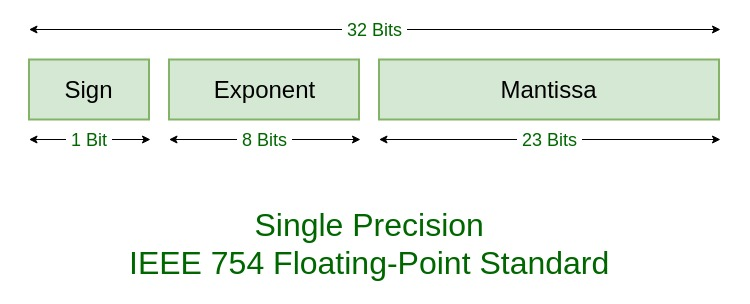

# Vertex Compression
In this tutorial we're going to investigate some techniques we can use to reduce our memory footprint. Imagine we have vertex data with the following attributes:

Position: vec3, 12 bytes \
TexCoord: vec3, 8 bytes \
Normal: vec3, 12 bytes

Such a layout will have a stride of 32 bytes. It's correct and it works, but can we represent the same info with less data?

## Half Precision Floats
OpenGL gives us some options with sending vertex data over, one of which is half precision floats. The idea is we can specify our data in half precision format, send it over, and it gets automatically converted to full precision floats when it hits the shader. Although half precision is not being used for ALU operations, we get the benefit of increased memory bandwidth.

Floating point numbers are represented by packing a number of bits together. Similar to scientific notation, we have a sign, mantissa (or coefficient) and an exponent.



Half precision formats are similar, except fewer bits are used to hold the mantissa and exponent.


C++ does not have native support for half precision types, so how do we store them? The solution is to pack the bits manually into a permissive data type such as uint_16. We're not doing any math on these things, after all, just transmitting the data to the GPU. We could do this ourselves, but there are some weird edge cases so I've deferred to people smarter than me, ie. stack overflow.

Once we've loaded in our data, we compress it to half floats, then send to the GPU. The next step is to tell the GPU we're sending half floats, so it decompresses them. This can be done during attribute pointer creation.
```
glVertexAttribPointer(0, 3, GL_HALF_FLOAT, GL_FALSE, 16, (void*)0);
glEnableVertexAttribArray(0);
```

## Bytes
Half precision is fairly elegant, and it gives us a big gain for saving memory: we're down to 16 bytes! Can we do better?

The answer is yes, both the normals and texture coordinates are expected to be normalized, ie. in the range [-1, 1] or [0, 1]. Wouldn't it be great if we could ignore the exponent and send just fractional data? OpenGL actually allows for this. We can send a byte of data, and then tell OpenGL that the byte represents normalized data. OpenGL will then convert that byte to a signed or unsigned float as requested.

Unlike half precision, the conversion is quite simple. We just want to map a float, which we expect to be already normalized, into a [0, 255] or [-127, 127] range.
```
unsigned char float_to_ubyte(const float x) {
    return 255 * x;
}

char float_to_byte(const float x) {
    return 127 * x;
}
```

The full attribute pointer creation would look like this:
```
//position
glVertexAttribPointer(0, 3, GL_HALF_FLOAT, GL_FALSE, 11, (void*)0);
glEnableVertexAttribArray(0);
//texture coordinates
glVertexAttribPointer(1, 2, GL_UNSIGNED_BYTE, GL_TRUE, 11, (void*)6);
glEnableVertexAttribArray(1);
//normal
glVertexAttribPointer(2, 3, GL_BYTE, GL_TRUE, 11, (void*)8);
glEnableVertexAttribArray(2);
```

## More Bytes
We're now down to 11 bytes, can we do better? Yes! Remember how we threw away the exponent for texture coordinates? This was because these attributes were expected to have a magnitude of 1. For our purposes we can conceptualise the exponent of a floating point number as its magnitude. This gives us a hint for how we can further compress our position data: all (x, y, z) components will have approximately the same exponent! When storing vertices we first fetch their normal, then store both the normalized vertex and the magnitude.
```
//position
glm::vec3 pos = v[std::stol(v_vt_vn[0]) - 1];
float magnitude = glm::length(pos);
vertices.push_back(float_to_ubyte(magnitude));
vertices.push_back(float_to_byte(pos[0] / magnitude));
vertices.push_back(float_to_byte(pos[1] / magnitude));
vertices.push_back(float_to_byte(pos[2] / magnitude));
```

Then tell the GPU about the memory layout:
```
//magnitude
glVertexAttribPointer(0, 1, GL_UNSIGNED_BYTE, GL_FALSE, 9, (void*)0);
glEnableVertexAttribArray(0);
//position
glVertexAttribPointer(1, 3, GL_BYTE, GL_TRUE, 9, (void*)1);
glEnableVertexAttribArray(1);
//texture coordinates
glVertexAttribPointer(2, 2, GL_UNSIGNED_BYTE, GL_TRUE, 9, (void*)4);
glEnableVertexAttribArray(2);
//normal
glVertexAttribPointer(3, 3, GL_BYTE, GL_TRUE, 9, (void*)6);
glEnableVertexAttribArray(3);
```

And reconstruct the positions in the vertex shader.
```
//---- Attributes ----//

layout (location=0) in float magnitude;
layout (location=1) in vec3 vertexPos;
layout (location=2) in vec2 vertexTexCoord;
layout (location=3) in vec3 vertexNormal;

// ...

//---- Functions ----//

void main()
{
    gl_Position = viewProj * model * vec4(magnitude * vertexPos, 1.0);
    // ...
}
//------------//
```

## Back to the Drawing Board
Our attempt has failed, why? It seems that a single byte does not have the appropriate
resolution to store the magnitude. OpenGL's interpretation of non-normalized bytes as floats uses C-Style casting,
so if magnitudes were whole numbers like 1, 2, 3 this would be fine, but that's not the case!

Furthermore, 9 bytes is an improvement, but 8 would be better. There must be a better way!
The hint lies in the fact that scale should really be set on a per-object basis.
Let's do a two-pass method, the first time we look through our loaded data and determine the object's size,
then the second time we use that size as a normalizing factor.

```
// first pass: load data
float magnitude = 0.0f;
file.open(modelNames[i]);
while (std::getline(file, line)) {

    words = split(line, " ");

    if (!words[0].compare("v")) {
        glm::vec3 pos = read_vec3(words, scales[i]);
        AABBs[i].min = glm::min(AABBs[i].min, glm::vec4(pos, 1.0f));
        AABBs[i].max = glm::max(AABBs[i].max, glm::vec4(pos, 1.0f));
        magnitude = std::max(magnitude, glm::length(pos));
        center += coefficient * pos;
        v.push_back(pos);
    }

    else if (!words[0].compare("vt")) {
        vt.push_back(read_vec2(words));
    }

    else if (!words[0].compare("vn")) {
        vn.push_back(read_vec3(words, 1.0f));
    }
}
file.close();

// second pass: build triangles
file.open(modelNames[i]);
while (std::getline(file, line)) {

    words = split(line, " ");

    if (!words[0].compare("f")) {
        read_face(words, v, vt, vn, vertices, history, indices, magnitude);
    }
}
file.close();
```

Then declare the attribute pointers without magnitude.
```
//position
glVertexAttribPointer(0, 3, GL_BYTE, GL_TRUE, 8, (void*)0);
glEnableVertexAttribArray(0);
//texture coordinates
glVertexAttribPointer(1, 2, GL_UNSIGNED_BYTE, GL_TRUE, 8, (void*)3);
glEnableVertexAttribArray(1);
//normal
glVertexAttribPointer(2, 3, GL_BYTE, GL_TRUE, 8, (void*)5);
glEnableVertexAttribArray(2);
```

So how do we recover magnitude? We could send it by a uniform, but in my case I have a per object-type acceleration structure, which has some spare floats.

```
struct AABB {
    glm::vec3 min = glm::vec3(1e30f);
    float magnitude = 0.0f;
    glm::vec3 max = glm::vec3(-1e30f);
    float padding = 0.0f;
};
```

I can even use that info in the compute shader to bake the scale transform into the model matrix.
```
//Save Model transform
modelTransforms[writePos] = transform * scale(boundingBoxes[objectType]);
```

## Success, but at what cost?
We have succeeded in reducing our memory footprint from 32 to 8 bytes per vertex, a 25% compression ratio.
However, the effect of this compression is starting to show: positions are less accurate, causing coarse meshes with z-fighting.
Clearly these techniques exist on a spectrum, and the more aggressive we get, the more visible the end result becomes.

Having said that, this is just one implementation. Your mileage may vary!